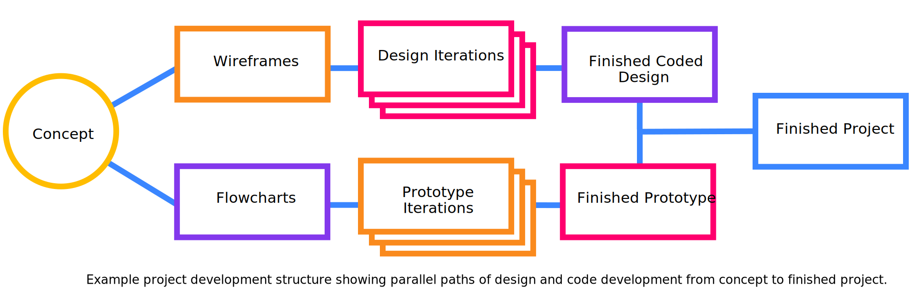

# Project Development Template

A framework for creative or social impact projects.

## Part I - Concept

Identify a topic, collect research, prepare a summary for a brainstorming session.

1. **Identify potential topics** area to explore. It shouldn't be too specific, nor too broad. Is there a specific problem you want to solve? Or do you wish to address issues by [problemitizing](https://en.wikipedia.org/wiki/Problematization) your subject?
1. **Collect research** (related articles, etc.) **and inspiration** (2-3 links or summaries of similar projects).
1. **Identify new skills or technologies** (e.g. a design method, programming pattern, code library, etc.) you are interested to learn and could potentially use in your project.
1. **Write a summary** of your topic(s), research, and technology (3–4 sentences). Address why you are drawn to this topic and why it is important to explore. Identify the communities, resources, and issues involved. What frameworks or methodologies might you use?
1. Bring the above to class for the...

<b>In-class activity</b>

In groups, brainstorm on your topic(s) using the <a href="materials/brainstorming-disney-method/" target="_blank">Disney Creative Strategy</a>. How might you create something that helps others discuss, think about, or help to solve the issue.

- The more ideas the better. Brainstorming aims to produce quantity, from which we select quality ideas.
- No criticism. Our goal is to generate a pool of ideas. All ideas are welcome.
- Follow the plan, which asks your group to assume different "hats" in order to ideate on concepts, solutions, and risks.

## Part II - Proposal

Create a pitch deck (10-15 slide Google Presentation) to share and plan your project that contains:

1. A one paragraph introduction to your concept and what you plan to make. Who will use this and why?
1. An initial attempt at an [identity](https://docs.google.com/presentation/d/1exnY8fjVsOc3bKZFESJIM2s4JKxhqg_oASPDPokSfrE/edit?usp=sharing) (e.g. a logo, word mark, style guide, etc.).
1. Examples (2–3) of similar works (in concept or tech) with images and links.
1. Flowcharts (2–3) showing each step users see, and another [showing how data works](https://www.google.com/search?q=a+flowchart+that+tracks+data+through+the+app&safe=off&tbm=isch) in the app
1. [Wireframes](https://www.dreamhost.com/blog/how-to-wireframe-website/) showing all the views in the interface (introduction page, forms, results page)
1. Technology - Include [pseudocode](https://en.wikipedia.org/wiki/Pseudocode) of the main logic of your project. List technologies and demos you think you will need. List the "unknowns"—parts of your idea that you don't know yet how to execute.

<b>In-class activity</b>

<a href="https://en.wikipedia.org/wiki/Lightning_talk">Lightning talks</a> of your pitches (3 min.)

## Part III - Prototype

Create a working “proof of concept” of your app.

1. Your prototype should contain the essential functions of your project.
1. Your work should be live (not public, just able to be shared via a link in Slack)
1. Feel free to fork and use any example repository from class to get started.

<b>In-class activity</b>

In groups, share your prototypes to get feedback:

- Be ready to explain the current status of your work.
- Bring specific questions or unknowns (concept, design, tech) you would like to discuss with your group.

## Part IV - Design

Design iterations of main views.

1. The design should reflect the overall concept and goals of your project.
1. Use the Bootstrap `designs/1.psd` template included in this repo or create your design iterations with [Figma](https://figma.com).
1. Create multiple iterations of each different page / view your app.
1. As per class [presentations](https://docs.google.com/presentation/d/1BiIHVEQjmIb2k2vB6N3x1g_S3KSLyZq2YCniq1ONjg8/edit?usp=sharing), look at relevant examples of good design to help you improve your own, then experiment and iterate!

<b>In-class activity</b>

Share your iterations to get feedback before coding the final design.

- Bring to class: What are three questions you would like to ask each user of your potential design?

## Part V - Deliverables

Your finished project should include:

1. Your coded design (valid [HTML](https://validator.w3.org/) and [CSS](https://jigsaw.w3.org/css-validator/)) combined with your prototype in a final application
1. The project should be live, hosted on Github Pages, Heroku, or your own server.
1. A well-designed, but simple page (preferably that is part of the project) to give your project context. This could be an introduction to the project or provided at the end to explain what happened.
1. A 200–300 word statement explaining your concept and execution.
1. An updated pitch (with screenshots and/or video) to document and share your finished project.

<b>In-class activity</b>

In class: We will share final projects in <a href="https://en.wikipedia.org/wiki/Lightning_talk">lightning talks</a> (5 min.)

## Notes

- While inspired by design thinking structures, this can be used for any creative or social impact project.
- Resources, documentation etc. can be found on specific course materials.
